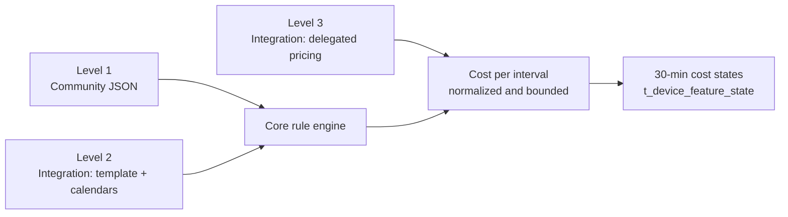
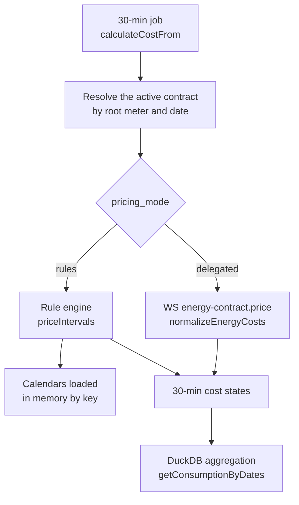

# Energy contracts: open energy cost tracking

> **Living specification — source of truth.** This document specifies how Gladys models an energy contract, the rule-based pricing engine that turns a 30-minute consumption interval into a cost, the tariff calendars that feed it, and the migration from the price-row model. **Rule: any PR that changes an energy-contract behavior or contract modifies this file in the same diff** — spec first, code second.
>
> The external-integration side of the design (the `energy_contracts` capability: manifest field, host API endpoints, WebSocket messages, SDK surface) lives in `docs/specs/external-integrations/capabilities/energy-contracts.md`, as the external-integrations spec layout requires. This file owns the core: data model, tariff definition, engine, jobs, REST API, frontend and migration.

## 1. Context and problem

Gladys energy tracking computes the cost of consumption with three contract types hardcoded in the core: `base`, `peak-off-peak` and `edf-tempo`. Any new contract type requires a PR on the monorepo, a migration of the SQLite enum and a Gladys release.

**What exists today (as of 21 September 2026)**

| Building block | File(s) | Role | Limit |
| --- | --- | --- | --- |
| Table `t_energy_price` | `server/models/energy_price.js` | One row per price: `contract` (3-value enum), `price_type` (`consumption` / `subscription`), `price` (integer, ×10,000), `currency`, `hour_slots`, `day_type` (`red` / `blue` / `white`), `subscribed_power`, `start_date` / `end_date`, `electric_meter_device_id` | The `hour_slots` and `day_type` columns are specific to French contracts; the `contract` enum blocks any new type |
| `energyPrice` manager | `server/lib/energy-price/` | Price CRUD + default electric meter | No notion of a "contract" as an object: a contract is a grouping convention over price rows |
| `energy-monitoring` service | `server/services/energy-monitoring/` | Scheduled jobs: consumption from indexes (30 min), cost every 30 min / from yesterday / from the beginning | The cost calculation calls `contracts[contract](...)` on a frozen object of three functions |
| Per-contract calculation | `contracts/contracts.calculateCost.js`, `contracts.buildEdfTempoDayMap.js` | One function per type; the Tempo colour comes from the internal `edf-tempo` service | The Tempo colour calendar is the only supported "external calendar", and it is wired to the EDF service |
| Community catalogue | `energy-monitoring.getContracts.js` | Downloads `contracts.json` from the latest GitHub release of `GladysAssistant/energy-contracts` | The file can only describe the three known types; an exotic contract has no place in it |
| Aggregation | `server/lib/device/energy-sensor/energy-sensor.getConsumptionByDates.js` | Groups cost states by hour / day / week / month / year (DuckDB), adds the pro-rated subscription, handles the billing period start day | The subscription is assumed monthly and fixed; no variable fees, no consumption tiers |
| External integrations | `server/lib/external-integration/` | Docker container framework with host API, WebSocket, manifest, store, capabilities (weather, widgets, scenes, webhooks…) | No "energy" capability: an external integration can neither declare a contract, nor feed a tariff calendar, nor compute a cost |

**Why it is too closed**

- A contract is modelled by its prices, never by its logic. Anything that does not fit "price × kWh by time slot and colour" is impossible: weekends, public holidays, vacations, seasons, consumption tiers, dynamic prices.
- Contracts outside France are out of reach: US Time-of-Use with summer / winter seasons and holidays, demand charges on peak power, Canadian tiered rates (Hydro-Québec Rate D), Japanese or Korean progressive tiers, hourly market prices (Octopus Agile, Tibber, Nord Pool).
- The only dynamic calendar source (Tempo colours) is an internal service, not reusable for another supplier.
- The community can only contribute a JSON of prices, never code: an "exotic" contract waits for a Gladys release.

**What this spec proposes**: make the contract a first-class object, with a rule-based pricing engine able to cover the vast majority of contracts worldwide without code, and an `energy_contracts` capability for external integrations that can declare contracts, feed tariff calendars (day colours, public holidays, spot prices) and, for the cases the rules cannot express, compute the cost of a 30-minute interval themselves.

## 2. Goals and non-goals

The goal is that an electricity contract from any country can be declared without touching the Gladys core, by the community (JSON catalogue) or by an external integration (manifest + code in its container).

**Goals**

1. **A contract becomes an object** (`t_energy_contract`) attached to a meter, with a validity period, a currency, a timezone and a **declarative tariff definition** (JSON). Prices are no longer the only model.
2. **A rule-based pricing engine** in the core, independent of any supplier, covering without code: time slots, weekdays / weekends, public holidays, vacations, seasons, day colours (Tempo and equivalents), progressive consumption tiers, imported hourly prices (spot), daily or monthly fixed fees, percentage taxes, and demand charges on peak power.
3. **An `energy_contracts` capability for external integrations**, within the existing framework (`docs/specs/external-integrations/`): declare contract templates in the manifest, publish tariff calendars (day colour, hourly prices, public holidays) through the host API, and when needed **compute the cost in code** (`external-integration.energy-contract.price`), under the same trust model as weather: bounded, normalized payload, never executed in the core. A contract can thus be published **entirely** as an external integration, with no change to any Gladys repository.
4. **A community catalogue in the new format**, backward compatible: the `GladysAssistant/energy-contracts` repository publishes complete tariff definitions (not just prices) for every contract that needs no code, and Gladys imports them in one click.
5. **Calculation and display stay generic**: the 30-minute cost job, the widgets and the aggregation API know no supplier by name. An exotic contract needs no specific UI.
6. **Transparent migration**: existing prices (`base`, `peak-off-peak`, `edf-tempo`) are converted automatically into contracts of the new shape, with no loss of the computed cost history.

**Non-goals (v1 of this spec)**

- Gas, water and production contracts (solar surplus buy-back): the model provides for them (`energy_type`, `direction` fields) but only consumed electricity is computed and displayed in v1.
- Exact billing to the cent: Gladys gives a faithful estimate, not a duplicate of the invoice (supplier rounding, adjustments, one-off commercial discounts).
- Net metering with cross-compensation of consumption / production: handled in a later spec, on top of the `direction` field.
- Price-driven optimisation (start a scene when electricity is cheap): the spec exposes the current price and the next tariff change through the API and a minimal scene trigger, but load steering is out of scope.
- Removing the internal `edf-tempo` and `ecowatt` services: they stay and become one calendar provider among others; their deprecation is a phase 3, as for `openweather`.

## 3. Concepts

Four concepts replace the "contract type + price rows" pair: the **contract**, its **tariff definition**, the **tariff calendars** that feed it, and the **contract provider**, which can be the community, an external integration or the user.

| Concept | Definition | Example |
| --- | --- | --- |
| **Contract** (`energy_contract`) | A meter's subscription over a period: name, root meter, currency, timezone, `valid_from` / `valid_to`, subscribed power, and a tariff definition. A meter has at most one active contract on a given date; contract changes are successive contracts. | "EDF Tempo 9 kVA" from 1 February 2025 to today |
| **Tariff definition** (`tariff`) | A versioned JSON document (`tariff_version: 1`) describing how to go from a 30-minute interval to a cost: components (consumption, fixed, tax, demand), ordered rules with conditions (time, day, season, calendar, tier), and required calendars. Interpreted by the core **rule engine**, never executed. | `{ "components": [ { "kind": "consumption", "rules": [ { "when": { "calendar": { "tempo": "red" }, "time": [["06:00","22:00"]] }, "price": 0.7562 } ] } ] }` |
| **Tariff calendar** (`tariff_calendar`) | A dated series of values external to the contract, indexed by day or by 30-minute interval: day colour, public holiday, spot price, critical peak period. Stored in the core, fed by a provider. A tariff definition references it by key (`tempo`, `holidays-fr`, `spot-fr`). | The `tempo` calendar is `red` on 12 January 2026 |
| **Contract provider** (`contract_provider`) | The source of a tariff definition or a calendar: `community` (`energy-contracts` repository), `integration` (external integration, by its `service_id`), `internal` (internal service such as `edf-tempo`), `user` (manual entry). An `integration` provider can additionally offer a **delegated pricing mode**: the core sends it the intervals to price and receives the costs. | The "Hydro-Québec" integration provides the `hydro-quebec-d` template and the `hq-critical-peaks` calendar |

**Three levels of openness, from simplest to most powerful**



Levels 1 and 2 go through the same engine: the difference is the source of the definition and of the calendars. Level 3 is reserved for contracts the engine cannot express; it produces exactly the same output and is subject to the same bounds.

**What a rule can test** (the engine conditions, all combinable with AND; the rules of a component are evaluated in order and the first match wins)

| Condition | Shape | Covers |
| --- | --- | --- |
| `time` | List of `["HH:MM","HH:MM"]` intervals in the contract timezone, start inclusive, end exclusive; an end at or before the start crosses midnight (an end equal to the start therefore covers the whole day); `24:00` accepted as an end, never `24:xx` | Peak / off-peak, TOU |
| `weekdays` | List `["mon","tue",…,"sun"]` | Weekends, weekday rates |
| `months` or `season` | List of months (1–12), or a `{ "from": "MM-DD", "to": "MM-DD" }` range repeated every year, inclusive, crossing 1 January allowed | US summer / winter, Asian seasons |
| `dates` | `{ "from": "YYYY-MM-DD", "to": "YYYY-MM-DD" }` absolute range, inclusive, `to` optional | Promotions, transition periods |
| `calendar` | `{ "<key>": <value or list> }` on a daily or 30-minute calendar; true only when the calendar has a value for the interval and it is in the list. A miss is an ordinary condition miss: the next rules and the `fallback` apply, **no warning** (a Tempo day without a colour yet is priced by the fallback silently) | Tempo, public holidays, school holidays, critical peak days |
| `not_calendar` | Same, negated: true when the calendar has no value for the interval or its value is not in the list. Absence counts as "not in the list" by design: the calendars this condition is written for are sparse (a holiday calendar lists holidays only, a critical-peak calendar lists event days only), so an absent day **is** the ordinary day | "Business day = not a holiday" |
| `tier` | `{ "cumulative": "day" \| "month" \| "billing_period", "from_kwh": 0, "to_kwh": 40 }` (`to_kwh` optional = open-ended); the rule prices the part of the interval's energy that falls in the tier and the following rules price the rest | Progressive tiers (Hydro-Québec, Japan, Korea, California baseline) |
| `power_threshold` | `{ "above_kw": N }`: the interval's peak power is strictly above N kW | Power-threshold tariffs |

**What a component can produce**: `consumption` (price × kWh, or `price_from_calendar` for an imported hourly price, with `multiplier` and `offset` for Tibber / Octopus Agile style formulas), `fixed` (amount per day or per month, pro-rated over the intervals), `tax` (percentage on the previous components), `demand` (amount per kW of peak power over the billing period, computed at period end and spread over its intervals).

## 4. Data model

Three new tables (`t_energy_contract`, `t_tariff_calendar`, `t_tariff_calendar_entry`) and a `t_energy_price` table kept read-only during the migration window, then dropped in a later release.

**`t_energy_contract`** (one row per contract, replaces the implicit grouping of `t_energy_price`)

| Column | Type | Rules |
| --- | --- | --- |
| `id` | UUID | primary key |
| `selector` | STRING unique | generated from `name` (`addSelector`, `buildUniqueSelector`) |
| `name` | STRING | user label ("EDF Tempo 9 kVA") |
| `electric_meter_device_id` | UUID → `t_device` | root meter, `ON DELETE CASCADE`; indexed |
| `energy_type` | STRING | `electricity` in v1; `gas`, `water` reserved |
| `direction` | STRING | `consumption` in v1; `production` reserved |
| `valid_from` | DATEONLY | inclusive, in the contract timezone |
| `valid_to` | DATEONLY nullable | inclusive; `NULL` = ongoing. Application constraint: no overlap for the same meter and direction |
| `currency` | STRING | ISO 4217 code (`EUR`, `USD`, `CAD`, `JPY`…), replaces today's free value `euro` |
| `timezone` | STRING | IANA; defaults to the Gladys system timezone, editable (a Tempo contract follows `Europe/Paris` even if the instance is elsewhere) |
| `billing_period_start_day` | INTEGER 1-31 | billing period start day, replaces the current global variable, used by tiers and demand charges |
| `subscribed_power` | DECIMAL nullable | in kVA or kW depending on `power_unit` |
| `power_unit` | STRING nullable | `kVA` or `kW` |
| `provider_kind` | STRING | `community`, `integration`, `internal`, `user` |
| `provider_service_id` | UUID nullable → `t_service` | the source integration or internal service; `ON DELETE SET NULL` (the contract survives uninstall, see the capability file) |
| `template_key` | STRING nullable | key of the source template (`edf-tempo`, `hydro-quebec-d`, `pge-e-tou-c`) to offer updates |
| `template_version` | STRING nullable | version of the imported template |
| `pricing_mode` | STRING | `rules` (core engine) or `delegated` (computed by the integration) |
| `tariff` | TEXT (JSON) | the tariff definition (§3), schema-validated on write, at least one component in `rules` mode; in `delegated` mode only `fixed` components are allowed and the tariff may be omitted (stored as `{ "tariff_version": 1, "components": [] }`, the integration prices everything) |
| `created_at`, `updated_at` | DATE | |

**`t_tariff_calendar`** (the durable declaration of a calendar: what the engine needs to read its entries, kept whatever happens to its provider)

| Column | Type | Rules |
| --- | --- | --- |
| `key` | STRING primary key | `^[a-z0-9][a-z0-9-]{0,63}$`; **global**: one calendar per key across the instance |
| `provider_service_id` | UUID nullable → `t_service` | the integration or internal service that owns the key: the first installed integration declaring it (capability file, §1); `ON DELETE SET NULL`: the row, its metadata and its entries survive the uninstall, the calendar is `orphaned` until an integration declaring the same key with the same granularity is installed and claims it |
| `granularity` | STRING | `day` or `thirty_minutes`, fixed for the life of the key (a redeclaration with another granularity is refused) |
| `timezone` | STRING | IANA timezone of a daily calendar (the day boundaries), copied from the declaration; the contract timezone when the declaration has none |
| `day_starts_at` | STRING | `HH:MM`, `00:00` by default (`06:00` for Tempo): the local time a daily value starts applying |
| `values` | TEXT (JSON) nullable | the enum of accepted string values declared by the provider, `NULL` for a price calendar |
| `currency` | STRING nullable | currency of a price calendar |
| `first_at`, `last_at` | DATE nullable | coverage, maintained on every write for the diagnostic UI |
| `updated_at` | DATE | |

**`t_tariff_calendar_entry`** (the dated values of the calendars, one row per day or per 30-minute interval)

| Column | Type | Rules |
| --- | --- | --- |
| `id` | UUID | primary key |
| `calendar_key` | STRING | `tempo`, `holidays-fr`, `spot-fr`, `hq-critical-peaks`…; `^[a-z0-9][a-z0-9-]{0,63}$` |
| `starts_at` | DATE (UTC) | start of the period the value covers |
| `value_string` | STRING nullable | `red`, `holiday`, `critical-peak`… (≤ 64 characters, within the declared `values`) |
| `value_number` | DECIMAL nullable | price per kWh in the calendar currency (`price_from_calendar`); **may be negative** (a fuel-cost adjustment is a credit some months: the TEPCO family test prices it at −3 JPY/kWh), so a component priced from a calendar, and an interval cost, can be negative |
| `updated_at` | DATE | |

Unique index `(calendar_key, starts_at)`, `calendar_key` → `t_tariff_calendar.key`; index `(calendar_key, starts_at DESC)`. A daily calendar stores `starts_at` at local midnight of the calendar timezone converted to UTC; the engine reads the entries through the metadata of `t_tariff_calendar` (timezone, `day_starts_at`) and evaluates the contract's own conditions in the contract timezone. A calendar only keeps the useful window in the database: the core purges everything older than the oldest consumption state of the instance minus 1 day.

**What does not change**

- Costs stay states of the `thirty-minutes-consumption-cost` feature (and `daily-consumption-cost`) in `t_device_feature_state` / DuckDB: no history migration, the widgets and the aggregation API keep reading the same thing.
- The `energy_parent_id` hierarchy (index → 30-min consumption → cost) and the root meter resolution (`getRootElectricMeterDevice`).
- Prices are stored as decimals in the `tariff` JSON (`0.2516`), no longer as ×10,000 integers: the conversion is done once by the migration.

**JSON schema of `tariff` (summary, version 1)**

```json
{
  "tariff_version": 1,
  "calendars": ["tempo"],
  "components": [
    {
      "key": "energy",
      "kind": "consumption",
      "rules": [
        { "when": { "calendar": { "tempo": "red" }, "time": [["06:00", "22:00"]] }, "price": 0.7562 },
        { "when": { "calendar": { "tempo": "red" } }, "price": 0.1568 },
        { "when": { "calendar": { "tempo": "white" }, "time": [["06:00", "22:00"]] }, "price": 0.1894 },
        { "when": { "calendar": { "tempo": "white" } }, "price": 0.1486 },
        { "when": { "calendar": { "tempo": "blue" }, "time": [["06:00", "22:00"]] }, "price": 0.1609 },
        { "when": { "calendar": { "tempo": "blue" } }, "price": 0.1296 }
      ],
      "fallback": { "price": 0.2516 }
    },
    { "key": "subscription", "kind": "fixed", "amount": 17.11, "per": "month" }
  ]
}
```

Validation rules: at most 16 components, 64 rules per component, 8 referenced calendars, any unknown key rejected (`400`), finite amounts ≥ 0 in the tariff itself except `offset` (calendar numeric values, and therefore the amount of a component priced from a calendar, may be negative), a `consumption` component must have a `fallback` or a last rule without `when` (no interval is ever left without a price), `tier.to_kwh` greater than `tier.from_kwh`, unique component keys, a tax applying to components declared before it, every referenced calendar listed in `calendars`.

The schema lives in `server/lib/energy-contract/tariff.schema.json` (the JSON Schema the ecosystem validates against: the `energy-contracts` catalogue tests, the store indexer, the SDK) and its canonical owner is the `energy-contracts` repository (same doctrine as `manifest.schema.json`). **It is the syntactic contract**: JSON Schema cannot express the last five rules above, so the core validates with the Joi mirror in `tariff.validate.js` plus its semantic checks, the schema `description` lists those semantic rules, and the catalogue and the indexer must run the core validator (a JS helper shipped with the SDK, other repository) on top of the schema. The test `tariff.schema.test.js` keeps the two in sync: every enumerated value, pattern and limit, and a **shared fixture pack** (valid tariffs accepted by both, invalid tariffs rejected by both, and the semantic-only tariffs that the schema accepts and the core rejects, which must be exactly the documented list).

**Inputs.** A template may carry `{{input:<key>}}` placeholders: a string that is exactly a placeholder is replaced by the input value whatever its JSON type (a number for a power, an array of time intervals for off-peak slots), a placeholder inside a longer string is replaced by its text. Substitution happens at compile time, before validation; a missing input is a validation error naming the key. An input is declared with a `key` (`[a-z0-9_]{1,64}`), a `type` among `number`, `select` (with `options`), `string` and `time_intervals` (a list of `["HH:MM", "HH:MM"]` slots picked on the 30-minute grid: the off-peak hours), optional `label` / `description` (multi-language), `unit`, `default` and `required`. The contract stores the values in its `inputs` column and the substituted tariff in `tariff`.

## 5. The `energy_contracts` capability

Owned by `docs/specs/external-integrations/capabilities/energy-contracts.md`: manifest field, host API endpoints, WebSocket messages, trust boundary of the delegated mode, provider discovery and lifecycle, SDK surface, and the two publishing paths (catalogue for code-free contracts, integration for everything else).

## 6. Use cases: what the engine must cover

The rule engine is validated against the contract families below; each row becomes an engine test case (`server/test/lib/energy-contract/tariffs/<country>-<contract>.test.js`) with a real JSON definition and expected intervals. The amounts in the examples are illustrative, never official tariffs.

| Country | Contract | Structure | Conditions used | Level |
| --- | --- | --- | --- | --- |
| France | EDF Base | Single price + monthly subscription | none, `fixed` | 1 |
| France | Peak / off-peak | 2 prices, slots specific to each meter (the slots are an `input`) | `time` | 1 |
| France | EDF Tempo | 6 prices, day colour from 6 am to 6 am | `calendar: { tempo }` + `time`; the `tempo` calendar is fed by the internal `edf-tempo` service (Gladys Plus), which becomes an `internal` provider | 1 + calendar |
| France | Weekend off-peak (Ohm, TotalEnergies) | Off-peak on weekdays + the whole weekend | `time` + `weekdays` | 1 |
| France | Spot-price offers (Ohm Spot, Urban Solar) | Hourly market price + coefficient and margin | `price_from_calendar: "spot-fr"` with `multiplier` / `offset`; 30-min calendar published by an integration | 2 |
| Belgium | Capacity tariff (Flanders) | kWh price + component on the monthly peak power | `demand` per kW, over `billing_period` | 1 |
| United Kingdom | Octopus Agile | Half-hourly price published the day before at 4 pm, capped | 30-min calendar published by the integration, or `delegated` mode | 2 or 3 |
| United Kingdom | Economy 7 | Reduced night price, 7 hours per region, GMT all year | `time` with `timezone: "Etc/GMT"` on the contract (the slots do not follow daylight saving) | 1 |
| United States | PG&E E-TOU-C (California) | Peak 4 pm - 9 pm, summer season (June - September) / winter, baseline credit on the first kWh | `time` + `season` + `tier` (`cumulative: billing_period`) | 1 |
| United States | ConEd TOU (New York) | Peak on weekdays only, holidays excluded, summer / winter | `time` + `weekdays` + `not_calendar: { "holidays-us": "holiday" }` + `season`; the holiday calendar is published by an integration or shipped by the catalogue | 2 |
| United States | Residential rate with demand charge (Arizona SRP, Georgia Power) | kWh price + $ per kW of the highest 30-minute demand of the month | `demand` over `billing_period`; the engine aggregates the `max_power_kw` of the intervals (§7), a 15-minute window is not modelled | 1 |
| United States | Critical Peak Pricing (SDG&E, OG&E) | Event days announced the day before, very high price over a window | `calendar: { "cpp-events": "event" }` + `time`; daily calendar published by the integration | 2 |
| Canada | Hydro-Québec Rate D | Two price tiers per day (first 40 kWh / day then the rest), daily subscription fee | `tier` with `cumulative: "day"` + `fixed` `per: "day"` | 1 |
| Canada | Hydro-Québec Flex D | Rate D + winter critical peaks (off-peak credit, high price during the peak) | `tier` + `calendar: { "hq-critical-peaks" }` + `time` + `season` (December - March) | 2 |
| Canada | Ontario TOU / ULO | Peak / mid-peak / off-peak, summer-winter inversion of the windows, weekends and holidays off-peak | `time` + `season` + `weekdays` + `not_calendar: { "holidays-ca-on" }`; holiday calendar from an integration or the catalogue | 2 |
| Japan | TEPCO tiered (従量電灯 B) | Three monthly progressive tiers + base fee by amperage + fuel surcharge + renewable levy | `tier` `cumulative: billing_period` + `fixed` depending on `{{input:amperage}}` + additional `consumption` for the surcharge (monthly `tepco-fuel-adjustment` calendar) | 1 + calendar |
| South Korea | KEPCO residential | Progressive tiers with different thresholds in summer (July - August) | `tier` + `season` (two sets of tiers) | 1 |
| Australia | TOU tariff + solar feed-in | Peak / shoulder / off-peak, daily supply charge | `time` + `weekdays` + `fixed` `per: "day"`; the solar feed-in is `direction: production`, out of v1 | 1 |
| Germany | Tibber / aWATTar | Hourly spot price + taxes and fixed grid fees per kWh | `price_from_calendar: "spot-de"` + `offset` + percentage `tax` | 2 |
| Norway / Sweden | Spot + capacity-based *nettleie* | Spot price + grid tariff by peak-power steps (average of the 3 highest hours of the month) | `price_from_calendar` + `demand` with `aggregation: "top3_average"` | 2 |
| India | Telescopic tariff (BESCOM, MSEDCL) | Monthly progressive tiers | `tier` | 1 |

**Three cases deliberately in delegated mode (level 3)** to prove that level 3 is necessary and sufficient: a contract whose price depends on a proprietary signal that cannot be published in advance (Octopus Agile with retroactive capping), a contract with a conditional discount on the month's total consumption decided by the supplier, and an energy community contract where the price depends on the shared production. The engine does not try to express them.

**Lessons for the engine** (what follows directly from the table)

- The `season` condition must accept a range crossing 1 January (`"11-01"` to `"03-31"`).
- `tier` must know three accumulations: `day`, `billing_period` and `month` (Hydro-Québec accumulates per day, TEPCO per billing period); the accumulation is recomputed on every job run from the start of the period, which sets the minimum recalculation window to the current billing period for a tiered contract.
- `demand` requires keeping the peak power per interval: the engine derives it from `kwh × 2` (30-min average) when no `power` feature is available, and from the meter `power` feature when it exists and is historized. This is an approximation documented in the UI.
- Public holidays are needed by most TOU tariffs (United States, Canada, Australia, Japan), but **national calendars stay out of the core**, the line already taken on #2999 and PR #3099: the core ships no holiday dataset and reserves no `holidays-*` key. A holiday calendar is either published by an integration (the `energy-calendar` integration of #3099, reoriented as an integration declaring `energy_contracts.calendars` and publishing through the host API) or shipped as dated entries by the catalogue v2 (`calendars` section, static for the years it covers, refreshed with the catalogue releases). Its key is a convention (`holidays-<country>[-<region>]`) that templates reference; the wizard shows which provider supplies it.
- School holidays and other regional calendars follow the same rule: integration or catalogue calendars, never core code.
- **Relationship with PR #3099** (`energy-calendar` type + `day-type` contract, same field need): that PR must not land as a second energy contract model in parallel; its provider API becomes the calendar publication of the `energy_contracts` capability, its `day-type` contract becomes a `calendar` condition of this grammar, and its `t_energy_price.day_type` widening is superseded by `t_tariff_calendar_entry`.

## 7. Cost calculation: engine, timezones, recalculations

The calculation remains a job of the `energy-monitoring` service every 30 minutes, but the `contracts[contract](…)` loop is replaced by a core module, `server/lib/energy-contract/`, which exposes `priceIntervals(compiledTariff, contract, intervals, options)` and knows neither supplier nor integration.



A consumption interval is priced by the active contract of the root meter at the interval start date. The mode decides the calculation, the output is identical.

**7.1 Evaluation context of an interval**

| Field | Source | Note |
| --- | --- | --- |
| `starts_at`, `duration_minutes` | `thirty-minutes-consumption` state (`created_at` − 30 min, as today); `duration_minutes` defaults to 30 and is 1440 for a daily feature | UTC instants. The 30-minute shift also applies to a daily state: the `daily-consumption` states are stamped at the **start** of their day (Enedis-style), so the interval keeps that day's local date; subtracting 1440 minutes would move it to the previous day |
| `local` | `starts_at` converted into `contract.timezone` | date, hour, weekday, month; this is where `time`, `weekdays`, `season` are evaluated |
| `kwh` | value converted to kWh (`convertEnergyUnit`) | |
| `max_power_kw` | meter `power` feature if historized (max over the interval), otherwise `kwh × 60 / duration_minutes` | required by `demand` and `power_threshold`; the cost job reads the peaks (`getMeterPowerPeaks`: the historized `power` feature of the root meter, W / VA divided by 1000, kW / kVA as they are, max per 30-minute slot of the contract's local clock computed by DuckDB, so a `:15` / `:45` zone such as Asia/Kathmandu keys the same slots as the intervals, loaded once per meter and run) only when a covering `rules` contract needs them (`compileTariff` reports `needsPower`), `/current` reads the peak of the meter's last interval the same way |
| `calendars[key]` | calendar value for the interval: `day` entry covering the local date (with `day_starts_at`, `06:00` for Tempo, declared by the calendar), or exact `thirty_minutes` entry | two distinct misses: a **condition** on an absent value is simply false (no warning, §3); a **price** (`price_from_calendar`) with no numeric value sends the energy to the component `fallback` **with a warning** |
| `cumulative[scope]` | kWh accumulated since the start of the day / month / billing period, **before** this interval | required by `tier`; computed in one ordered pass over the intervals given, starting from the caller's `cumulative_before`. Zero is only correct when the run starts at the accumulation boundary: every caller of a tiered contract either starts its window at the boundary (the cost job recomputes from the start of the day / period, 7.4) or passes the real `cumulative_before` (the preview and `/current` compute it from the meter's stored consumption states) |

**7.2 Evaluating a component**: `consumption`: first rule whose conditions are all true, otherwise `fallback`; price × kWh (for `tier`, the interval may straddle two tiers: it is split pro rata of the kWh, the rule prices its share and the following rules price the remainder). When the matching rule's calendar price is missing, the energy it should have priced goes to the `fallback` with a warning, **never to a later rule**: a later rule was not meant to price this interval, and for tiers a later tier must not price kWh the missing tier already claimed. `fixed`: amount spread over the intervals of the local day (`per: day`) or of the calendar month (`per: month`): `amount × duration / period duration`, which replaces the current "monthly price ÷ days in the month" approximation of `calculateSubscriptionPrices` and allows storing the subscription **in the cost states** instead of recomputing it at display time. `tax`: percentage applied to the components listed in `applies_to`. `demand`: computed only over a closed period (see 7.4): the aggregate peak power of the period (`max`, or `top3_average` = mean of the three highest interval peaks on distinct days) × the price per kW, spread over the period's intervals pro rata of their duration, never estimated mid-period. Its period conditions (`when`: months, season, dates, weekdays) are evaluated **per interval**: the component applies to the intervals of the period that satisfy them, the peak is taken among those only and the charge is spread over those only (a billing period straddling 1 July with `months: [7, 8]` is charged on its July peak, over its July intervals).

The cost of an interval is the sum of the components, rounded to 6 decimals; components are not stored individually in v1 (one state per interval, as today) but the engine returns them so the preview and a later per-component feature can use them. A "breakdown by component" UI is a possible extension that would add one cost feature per component.

**7.3 Timezones and daylight saving**

- All time conditions are evaluated in `contract.timezone`, never in the instance timezone nor the Node process one. A contract may set a timezone without daylight saving (`Etc/GMT` for Economy 7).
- A `time` interval `["22:00", "06:00"]` crosses midnight; on a clock-change day the local day has 46 or 50 intervals and the `fixed per: day` spreading accounts for it (division by the real duration of the day).
- A daily calendar with `day_starts_at` shifts the reference date: an interval at 03:00 on 13 January reads the value of 12 January when `day_starts_at` is `06:00` (today's Tempo behaviour, generalised).

**7.4 Job scheduling** (evolution of `energy-monitoring.init.js`)

| Job | Frequency | Window | What is new |
| --- | --- | --- | --- |
| 30-min cost | `0,30 * * * *` | last interval | unchanged; the costs of the window are priced first and only then replaced, in one DuckDB transaction (`replaceHistoricalStatesFrom`: a pricing failure, a write failure or a crash between the delete and the insert leaves the previous costs in place); the job reports the devices whose costs failed instead of throwing; for a `tier` contract, recomputes from the start of the relevant accumulation (day or period): only the contracts **covering the run window** widen it, an expired or a future tiered contract never does. The window is priced per billing period (a closed period gets its `demand` charges); when the billing day is not the 1st, the `month` accumulation of the previous period is carried into the next one as `cumulative_before` (7.1), the billing-period accumulation restarts; a skipped period or a new calendar month restarts the month accumulation |
| Cost from yesterday | 11:10 and 16:10 local | 24 h | unchanged (late Enedis data) |
| Recalculation on calendar change | on demand, bounded 1 / 10 min / calendar | from `changed_from`, never before the earliest `valid_from` of the contracts referencing the calendar (the initial fill of a calendar carries years of history) | new (capability file, host API) |
| Billing period end | once a day at 02:00 local, acts when a period ended in the last 3 days | the elapsed period, repriced as closed | new: `demand` applied (the job of every run prices an elapsed billing period as closed and the current one as open); the same run purges the calendar entries older than the oldest consumption state minus one day |
| `delegated` catch-up | every 30 min with the main job | oldest 30-minute interval without a cost state, ≤ 31 days back, for the meters whose active contract is delegated | new |
| Full recalculation | manual (existing button) | from the beginning | unchanged; runs in 31-day chunks for delegated mode |

**7.5 Performance**: the engine precompiles each contract once per run (`compileTariff`: inputs substituted, rules validated, `time` intervals in minutes, weekdays and seasons as numbers; calendars loaded into a lookup by key for the run window, like `buildEdfTempoDayMap` today); measured target: 1 year of 30-min data (17,520 intervals) priced in under 2 s for a 6-rule `rules` contract on a Raspberry Pi 4. The in-memory calendar cache is invalidated by `changed_from` on every publication.

**7.6 Errors**: an invalid definition is rejected on write, never discovered by the job. At run time, the only possible errors are "calendar **price** without a value" (`price_from_calendar` unresolved: fallback + warning counted in the job; a calendar *condition* on an absent value is not an error, §3) and "delegated integration unreachable or invalid payload" (intervals left without a cost, error visible on the Jobs page and on the contract page). A meter without an active contract on a date produces no cost state, as today.

**7.7 Current price** (`getCurrentPrice`, behind `/current`, the widget and the scene trigger): the unit price at an instant is the sum of the consumption components' matching rule prices (a tier rule matches when the next kWh falls in its tier, from the `cumulative` the caller passes) plus the taxes applying to them; fixed and demand components are not per-kWh and are left out. `power_threshold` rules are evaluated on the `max_power_kw` the caller passes (the peak of the meter's last interval), 0 when unknown. The instant is first snapped to the **start of its 30-minute slot on the contract's local clock** (a `:45` zone such as Asia/Kathmandu is not aligned on UTC): 30-minute calendars are keyed by slot start and a live call never lands on an exact slot instant. A matching rule whose calendar price is missing yields the `fallback`, as in 7.2; when the fallback itself has no value the price is `null` ("unknown") rather than a guess. The next change is found by scanning the following slot boundaries over a 48-hour horizon, comparing price and rule label.

## 8. REST API and user interface

The `energy_price` API is replaced by an object-oriented `energy_contract` API, and the "Energy Rates" tab becomes a "Contracts" tab where the user picks a template, fills in its parameters and sees a preview before saving.

**8.1 Routes (admin, `server/api/routes.js`)**

| Route | Role |
| --- | --- |
| `GET /api/v1/energy_contract?electric_meter_device_id=` | List of contracts, with a computed `status`: `active`, `scheduled`, `expired`, `orphaned` |
| `POST /api/v1/energy_contract` | Creation; rejects a date overlap on the same meter (`409`); validates `tariff` against the schema (`400` detailed: JSON path of the error) |
| `PATCH /api/v1/energy_contract/:selector` | Update; a change of `tariff` or `valid_from` triggers a recalculation from the contract `valid_from` (bounded to the start of the data) |
| `DELETE /api/v1/energy_contract/:selector` | Deletion; the cost states of the period are removed on the next recalculation |
| `POST /api/v1/energy_contract/preview` | Body `{ tariff, inputs, timezone, currency, from, to, electric_meter_device_id, billing_period_start_day }` (window ≤ 31 days, last 7 days by default): prices the meter's real intervals over the period without writing anything, returns the total per component, the warnings count and up to 48 sample intervals (`kwh`, `unit_price`, `cost`, `label`); a meter without stored consumption is priced on a flat synthetic profile of 0.5 kWh per interval (`synthetic: true`); a `delegated` tariff cannot be previewed. For a tiered tariff the core computes `cumulative_before` from the meter's stored consumption states between the accumulation boundary and `from`, so a mid-period window is priced in the right tier. This is what makes an exotic contract verifiable by the user before applying it |
| `GET /api/v1/energy_contract/template` | Available templates, merged (internal services, installed integrations, community catalogue, the catalogue being optional when unreachable): `key`, `name`, `country`, `currency`, `pricing_mode`, `provider` (`kind`, `name`, `service_id`, `running`), `inputs`, `version`, and for a v1 catalogue entry a `variant` (the subscribed power, one template per power) |
| `POST /api/v1/energy_contract/recalculate` | Body `{ from }`: recompute the costs of every meter carrying a contract from that instant (the calendars page button) |
| `GET /api/v1/energy_contract/:selector` | One contract |
| `GET /api/v1/energy_contract/template/:provider/:key?variant=&service_id=` | The full template (`tariff`) to instantiate it |
| `GET /api/v1/energy_contract/:selector/current` | Current price, current tier and next change (`{ price, currency, valid_until, next_price, label }`) for the widget and the assistant, computed with the real accumulations of the day / month / billing period and the peak of the last interval read from the stored states (7.7); in delegated mode relays `energy-contract.current` with the same state and a 5-min cache |
| `GET /api/v1/energy_calendar` and `GET /api/v1/energy_calendar/:key?from=&to=` | Known calendars (key, provider, granularity, `first_at` / `last_at` coverage) and their values, for the diagnostic UI |
| `GET /api/v1/energy_price*` | **Kept read-only** for 2 releases, answering from the migrated contracts so user scripts do not break; `POST` / `PATCH` / `DELETE` return `410` with a message pointing to the new API |
| `GET /api/v1/service/energy-monitoring/contracts` | Kept: still serves the catalogue, now preferring `contracts-v2.json` (§9.4); `energy_contract/template` merges it with the integration templates |
| `GET /api/v1/device_feature/energy_consumption` | Unchanged on the contract side; the subscription is no longer added on the fly (`calculateSubscriptionPrices` is gone: the contract carries it in its states, §7.2), a `subscription_included: true` field on the cost series tells the frontend |

The `period_start_day` parameter of the aggregation is still accepted and still defaults to 1: the billing day of the energy-consumption widget stays a per-widget setting, set by the user to match their contract (deriving it from the meter's active contract is a follow-up, not part of this delivery).

**8.2 Interface (`energy-monitoring` page, Contracts tab)**

1. **Contract list** per meter: name, provider (community / integration / manual badge), period, mode (`rules` / `delegated`), status. An `orphaned` contract or one with a calculation error carries a call to action.
2. **4-step creation wizard** (`front/src/routes/integration/all/energy-monitoring/contracts/`): (a) meter (or the creation of an MQTT meter, as before); (b) template, filtered by country and by a text search, with the source visible (catalogue or integration name, "integration stopped" badge) and the "propose a contract to the community" block (the existing `contractNotListed*` text, completed with "or publish it as an integration"); (c) template parameters (`inputs`: power, off-peak slots with the existing 48-button grid, region), name, dates, currency, timezone, billing period start day; (d) **preview** over the last 7 days of real consumption through `preview`, with the total per component and the table of the sample intervals (time, kWh, unit price, cost, rate label), then save. A `delegated` template skips the preview. Editing a contract opens the wizard on step (c) in JSON mode.
3. **Advanced editor**: a "JSON" mode on step (c) to type or paste a complete tariff definition, with live schema validation and the same preview. It is the equivalent of today's manual entry, but general, and the natural first step before contributing: an "export as template" button produces the `templates[]` entry ready for a catalogue PR or an integration manifest. No graphical rule editor in v1.
4. **Calendars section** (Settings tab of the energy-monitoring page): for each calendar, the provider (or "no provider" when orphaned), the granularity, the coverage and the last 30 values; a "recalculate the costs from" date button (`POST /energy_contract/recalculate`).
5. **Existing dashboard widget** (`energy-consumption`) unchanged; a new small "electricity price" widget (`energy-price` box, config `{ energy_contract: <selector>, name? }`) shows the current price, the current tier, the next change and today's kWh (`/current`, refreshed every 5 minutes), for every contract without specific code.
6. **Scenes**: an `energy-contract.price-changed` trigger (the contract moves to another tier / price) and an `energy-contract.current-price` condition (current price compared to a threshold), fed by the core from the active contract, with no additional integration contract. The trigger is fired by `energyContract.checkPriceChanges()`, called at the end of the 30-minute job of `energy-monitoring`: for every `active` contract it compares the `price` and `label` of `getCurrent` with the last values observed (kept in memory per contract id) and emits `{ contract, price, previous_price, label, previous_label, currency }` on a change; the first observation after a start only records the values, so a restart never fires the trigger. The trigger stores the contract selector in `energy_contract` (empty = any contract); the condition stores `energy_contract`, `operator` (`=`, `!=`, `>`, `>=`, `<`, `<=`) and `value` (per kWh, in the contract currency) and aborts the scene when the price is unknown (`null`, §7.7) or does not satisfy the comparison.

**8.3 AI assistant and weekly digest**: the digest resolves the main meter through `getDefaultElectricMeterFeatureId`, now backed by the most recent contract; the chat tool keeps reading the aggregated costs (`getConsumptionByDates`), which now carry the subscription. Naming the most expensive tier of the week from the rule labels is a possible extension.

**8.4 Translations**: every string in `front/src/config/i18n/*.json` (`integration.energyMonitoring.contracts.*` keys), `compare-translations` in CI; template names come from the manifests or the catalogue (multi-language, `en` required), never from the core.

## 9. Migration and compatibility

The migration converts each group of `t_energy_price` rows into an equivalent `rules` contract, without touching the cost history, and verifies itself by comparing the old and new calculation over the last 7 days.

**9.1 Grouping**: one contract row per `(electric_meter_device_id, contract_name, contract, subscribed_power, start_date)`; the group `end_date` = the largest `end_date` (or `NULL`); `currency` `euro` → `EUR`; `timezone` = system timezone; `billing_period_start_day` = 1 (the billing day is a per-widget setting today, not a system variable); `provider_kind` = `community` and `template_key` = `contract_name` when the name matches a catalogue template key, otherwise `user`; Tempo contracts get the `Europe/Paris` timezone; several validity periods of one contract share its name and get unique selectors.

**9.2 Translation of the three types**

| Old `contract` | Generated `tariff` |
| --- | --- |
| `base` | one `consumption` component with `fallback: { price: price / 10000 }` |
| `peak-off-peak` | one rule per row: `hour_slots` (`"22:00,22:30,…"`) converted into merged `time` intervals; the row covering the most slots becomes the `fallback` |
| `edf-tempo` | `calendars: ["tempo"]`, six `calendar: { tempo } + time` rules, `fallback` = blue off-peak price; the `tempo` calendar is declared with `day_starts_at: "06:00"`, `timezone: "Europe/Paris"`, provider `internal` = `edf-tempo` service, which fills it from `gateway.getEdfTempoHistorical` (the current LRU cache disappears in favour of the table) |
| `subscription` row | one `fixed` component `{ amount: price / 10000, per: "month" }` |

**9.3 Verification built into the migration**: after conversion, the core prices the last 7 days of each meter with the old code (kept in a `legacy/` module removed two releases later) and with the new engine; a gap above 0.5% is logged as a warning with the per-day detail and shown on the Contracts page ("check this migrated contract"). The migration runs at the start of Gladys, after the devices are loaded, until every group is converted: a system variable marks it done only when no group failed, a failed group is retried at the next start and the groups already converted are found again by `(meter, valid_from, name)` and never duplicated. A created contract is kept whatever its verification does (a verification error is logged, the contract has no warning); a Tempo contract cannot be verified at that point because the `tempo` calendar is declared by the `edf-tempo` service, which starts after the migration, so its verification is skipped. The migration then queues one full cost recalculation of the migrated meters from the earliest `valid_from`, so every stored cost carries the subscription of its contract like the new ones (§7.2) and the display stays consistent over the whole history: because the `energy-monitoring` service is not listening yet when the migration runs, the request is stored in the `ENERGY_CONTRACT_PENDING_RECALCULATION` variable **before** the done marker, read by the service at its start (`getPendingRecalculation`) and cleared only once the recalculation succeeded for every device (`clearPendingRecalculation`; the cost job reports the devices whose costs failed instead of throwing), so an interrupted or failed rewrite is retried at the next start; the event is emitted as well for a migration run while the service is up.

**9.4 Compatibility kept**

- `GET /api/v1/energy_price` still answers, projected from the contracts (one synthetic row per `consumption` rule and per `fixed` component), for 2 releases; writes return `410`.
- `getDefaultElectricMeterFeatureId` (used by external integrations, `getDiscoveredDevices`, and the digest) now reads the most recent contract; unchanged signature, exposed by an `energyContract` manager replacing `energyPrice` in `server/lib/index.js` (the old name stays as an alias for one release).
- The `contracts.json` file of the `energy-contracts` repository keeps its current format (one folder per provider, a `convert.js` per contract, `npm run build`); Gladys converts it at import through the same translation table as 9.2, `TO_REPLACE_*` slots becoming an `input`. The repository then publishes, in the same release, a `contracts-v2.json` in the `templates` format of the capability file, generated by `process.js` from the same sources (a generic v1 → v2 converter, existing `convert.js` files untouched); new contracts are contributed directly in v2 as a `template.json` validated by `tariff.schema.json`. Gladys prefers v2 when the release includes it. Template keys keep the v1 identifiers (`edf-tempo`, `edf-base`…) so migrated contracts link to them through `template_key`.
- The `ENERGY_CONTRACT_TYPES`, `ENERGY_PRICE_TYPES`, `ENERGY_PRICE_DAY_TYPES` constants are kept for the compatibility window, then removed with the table.
- Existing external integrations are not affected: the core derivation of energy features (C.3) does not change, and an integration without an `energy_contracts` field sees no difference.

**9.5 Rollback**: the `down` migration drops the three tables (`t_energy_contract`, `t_tariff_calendar`, `t_tariff_calendar_entry`); since `t_energy_price` is not modified before its deferred removal, going back to the previous version finds the prices untouched.

## 10. Delivery plan, tests, open questions

Delivered as **one pull request** ([#3130](https://github.com/GladysAssistant/Gladys/pull/3130)), the maintainer having asked for the whole feature at once rather than the five-step plan first drafted. The pull request carries, in this order of dependency:

| # | Part | Content |
| --- | --- | --- |
| 0 | Spec | This document + `docs/specs/external-integrations/capabilities/energy-contracts.md` + `tariff.schema.json` |
| 1 | Engine | `server/lib/energy-contract/` (pure module, `engine.js` barrel): JSON schema and Joi validation, `compileTariff`, `priceIntervals`, `computeDemandCharges`, `getCurrentPrice`, the calendar lookup, per-contract tests of section 6 |
| 2 | Model and migration | The three tables, the `energyContract` manager (`server/lib/energy-contract/index.js`: contracts, calendars, templates, preview, current price, legacy projection, migration 9.1 - 9.3 with the `legacy/` module), `energy_contract` routes + read-only `energy_price`, `energy-monitoring` switched to the engine with the new jobs, `edf-tempo` as provider of the `tempo` calendar, calendar ownership and orphaning |
| 3 | Interface | Contracts tab, 4-step wizard, preview, JSON editor with template export, calendars section, electricity price widget, scene trigger and condition, translations, Cypress |
| 4 | Integration capability | Manifest field and `validateManifest`, host endpoints, WebSocket messages, `normalizeEnergyCosts`, lifecycle |
| 5 | Catalogue | Gladys-side import preferring `contracts-v2.json` and converting `contracts.json` (v1) through the section 9.2 table |

Left to other repositories: the JS SDK, the Node.js template example and the store indexer checks (capability file, section 5), and the `contracts-v2.json` publication by `energy-contracts` (§9.4). A pilot external "Octopus Energy" integration (`rules` Economy 7 template + 30-min Agile calendar), published in the store as a contributor would, is the proof that a contract can ship entirely outside the Gladys repositories.

**Tests** (100% patch coverage required on the server side)

- Engine: one test per row of section 6 with a complete definition and expected intervals; edge cases: clock change (46 / 50 intervals), `time` interval crossing midnight, `season` crossing 1 January, `tier` straddling two tiers, missing calendar → fallback, `day_starts_at`.
- Schema: each validation rule of section 4 rejected with the expected JSON path.
- Migration: `t_energy_price` rows covering the three types (the real Tempo price history in `test/services/energy-monitoring/data/`), the 0.5% comparison between `legacy/` and the engine over 7 days, the `GET /energy_price` projection.
- Capability: `validateManifest` (limits, keys, `tariff` forbidden in `delegated`), endpoints (`403` undeclared calendar, `400` value outside the enum, time window), `normalizeEnergyCosts` (missing interval, negative cost, cost above the bound, unrequested intervals ignored), WS timeout → no state written, catch-up bounded to 31 days, uninstall → `orphaned`.
- Frontend: Cypress on the wizard (`front/cypress/e2e/routes/integration/energy-monitoring/Contracts.cy.js`: manual contract created against the real server, preview shown, contract listed then deleted, overlap refused); `compare-translations`.
- Manual verification (capability file): install the Octopus pilot, create a delegated Agile contract, stop the integration for 2 h, restart it, observe the catch-up with neither gap nor duplicate.

**Open questions**

- [x] **Subscription in the cost states or at display time?** In the states (7.2), so every aggregation is consistent; a contract change recomputes the costs from its `valid_from`, and the migration recomputes the whole history once (9.3).
- [x] **Timezone per contract or per instance?** Per contract (Economy 7, Tempo outside France): a wizard field, defaulting to the template's timezone, then the system one.
- [x] **`max_price_per_kwh` bound of the delegated mode**: 10 units / kWh fits EUR, USD, CAD, GBP but not JPY nor KRW: a per-currency table in the core (`MAX_ENERGY_PRICE_PER_KWH_BY_CURRENCY`, capability file §3) raises the bound for the currencies whose unit is small.
- [x] **`demand` in v1 or v1.1?** In v1: every run prices an elapsed billing period as closed, and the 02:00 job reprices the period that just ended (7.4).
- [ ] **Consent on a manifest update** that adds `energy_contracts`: same known limit as `location` and `webhooks` (C.3), to be handled globally, not here.
- [x] **Where do contracts get published?** Decided (maintainer, 22 September 2026): both paths, split by need. Code-free contracts stay in the `energy-contracts` catalogue; anything needing code or live calendars is an external integration, which may also carry its own static templates.
- [x] **Holiday calendars in the core?** Decided (review of PR #3130, 22 September 2026): no, the #2999 / #3099 line holds. Holidays are calendars published by an integration or shipped by the catalogue v2 (section 6); the core ships no dataset and reserves no key.
